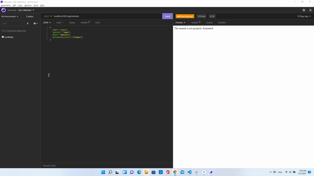

# ORM_C_ECMBE
E-commerce Back End

## Table of Contents

## Description

This app is API server, built on Express.js that uses ORM to manipulate database.

## Installation

1. clone GitHub repo.
2. `npm install`.
3. `source db/schema.sql`
4.`npm run seed`
5.`npm start` or `Nodemon Start`.

## Video

Video: [Google Drive](https://drive.google.com/file/d/1IPvICsyt1COf4kIaUw9DNo9mBIHt0Okv/view?usp=sharing)

### API Endpoints

The following describes available API endpoints.
